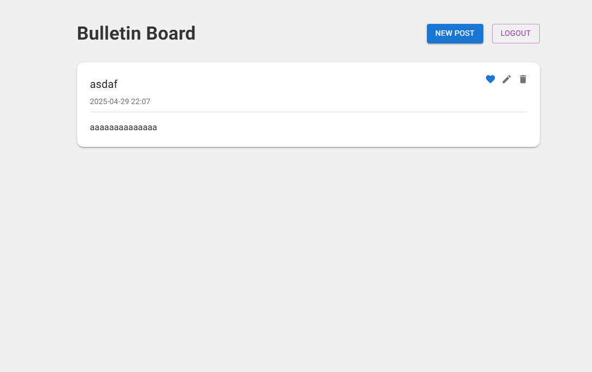

# 📰 Bulletin Board - Prueba Técnica Datawalt

Este proyecto es una aplicación de tablero de anuncios (Bulletin Board) desarrollada como parte de una prueba técnica para **Datawalt**. Permite a los usuarios autenticarse, crear, editar, eliminar y marcar publicaciones como favoritas, manteniendo la información protegida por sesión.

---

## 🛠️ Tecnologías Utilizadas

- **Next.js 14 (App Router)**
- **TypeScript**
- **Prisma ORM** + **SQLite**
- **MUI (Material UI)** para UI moderna
- **bcrypt** para hasheo de contraseñas
- **Cookies de sesión** (`httpOnly`)
- **Day.js** para manejo de fechas

---

## ✨ Funcionalidades

- **Registro e inicio de sesión** de usuario con cookies seguras.
- **Creación de publicaciones** con título y contenido.
- **Edición y eliminación de publicaciones** (solo por su autor).
- **Marcado de favoritos** (persistencia en `localStorage`).
- **Cierre de sesión**.
- **Diseño responsivo** y moderno con MUI.

---

## 🚀 Instalación y Ejecución

### 1. Clona el repositorio

```bash
git clone https://github.com/tu-usuario/prueba-datawalt.git
cd prueba-datawalt
```

### 2. Instala dependencias

```bash
npm install
```

### 3. Configura la base de datos

```bash
npx prisma migrate dev --name init
npx prisma generate
```

### 4. Inicia el servidor de desarrollo

```bash
npm run dev
```

La aplicación estará disponible en [http://localhost:3000](http://localhost:3000).

---

## 🧪 Rutas API

| Método | Ruta                   | Descripción                                     |
|--------|-------------------------|-------------------------------------------------|
| POST   | `/api/login`            | Inicia sesión y guarda cookie de sesión         |
| POST   | `/api/register`         | Registra nuevo usuario                          |
| POST   | `/api/logout`           | Cierra sesión                                   |
| GET    | `/api/posts`            | Lista todas las publicaciones                   |
| GET    | `/api/posts/:id`        | Obtiene una publicación por ID                  |
| PUT    | `/api/posts/:id`        | Edita una publicación (solo por su autor)       |
| DELETE | `/api/posts/:id`        | Elimina publicación (solo por su autor)         |

---

## 🔐 Autenticación y Sesiones

Se utilizan **cookies (httpOnly)** para gestionar sesiones de usuario.

Las rutas protegidas validan el ID del usuario en la sesión para permitir acciones como **editar** o **eliminar** publicaciones.

---

## 📁 Estructura Relevante

```bash
src/
├── app/
│   ├── api/
│   │   ├── login/
│   │   ├── logout/
│   │   ├── register/
│   │   └── posts/
│   │       ├── route.ts
│   │       └── [id]/
│   │           └── route.ts
├── lib/
│   ├── db.ts            # Configuración de Prisma
│   └── session.ts       # Funciones para manejar sesión
└── components/
    └── Home.tsx         # Página principal con UI y lógica
```

---

## 📸 Capturas de Pantalla

Puedes agregar aquí capturas de la aplicación en ejecución. Ejemplo:



---

## 📄 Licencia

Este proyecto fue desarrollado como parte de una prueba técnica. Su uso está limitado al propósito de evaluación.

---

## ✉️ Contacto

Para más información o preguntas sobre la prueba técnica, puedes contactarme a [javier.a.mada@gmail.com].

---